#Data Engineering Nano Degree

##Capstone Project 

###Sam Ariabod - 2019.28.05

##Purpose
Find out if there is any correlation between temperature and crimes reported.

##Simulation
Our imaginary company has a process set up that dumps crime data and temperature data into a datalake on s3. We need to build a workflow that can extract relevent data from both buckets, run an aggregation on them, then store the data back into a bucket to be analyzed by stake holders.

##Data

###Temperature: 
[Historical Hourly Weather Data 2012-2017](https://www.kaggle.com/selfishgene/historical-hourly-weather-data)

[Courtesy of Selfish Gene via Kaggle](https://www.kaggle.com/selfishgene)

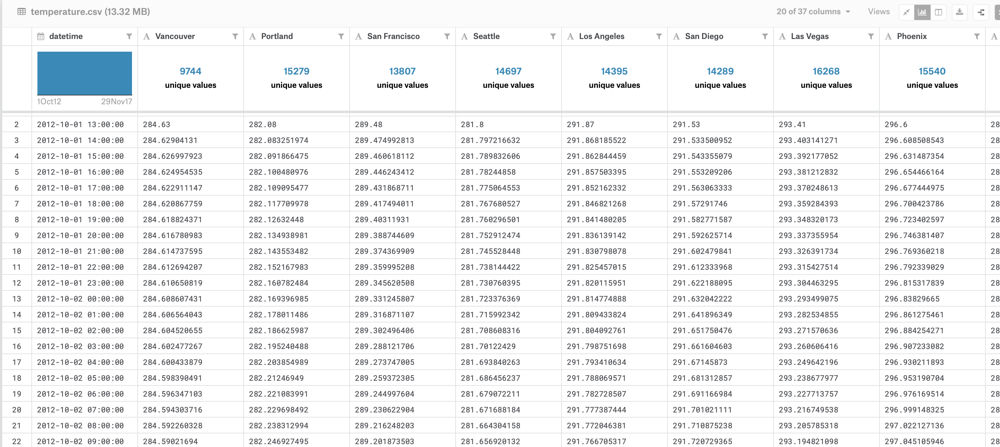

"The dataset was aquired using Weather API on the OpenWeatherMap website, and is available under the ODbL License."

I converted this dataset to JSON and put into s3 broken up by day to simulate log files.
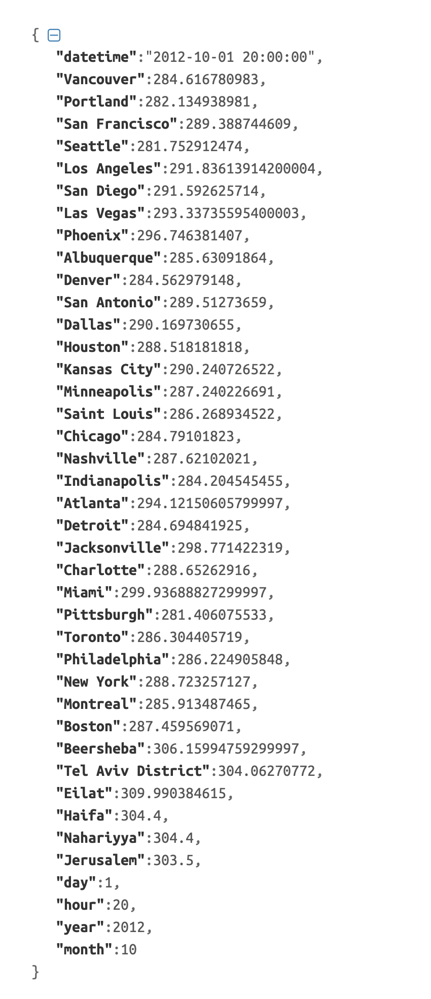
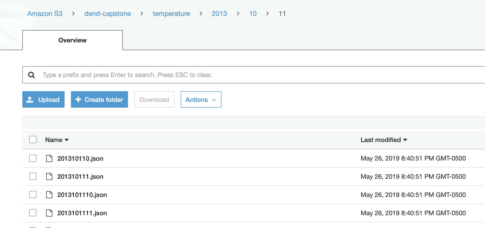

___
###Crimes:
[Los Angeles Open Data](https://data.lacity.org)

Crime data from 2010 to Present 
~2,000,000 Rows

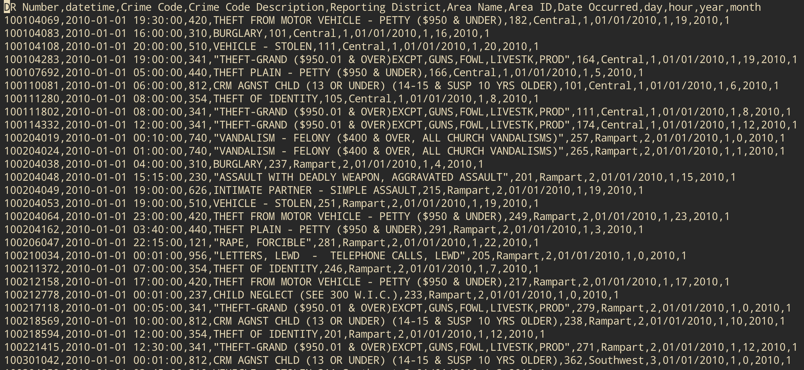

This dataset was broken up and stored on s3 using CSVs segmented by day to simulate log files.

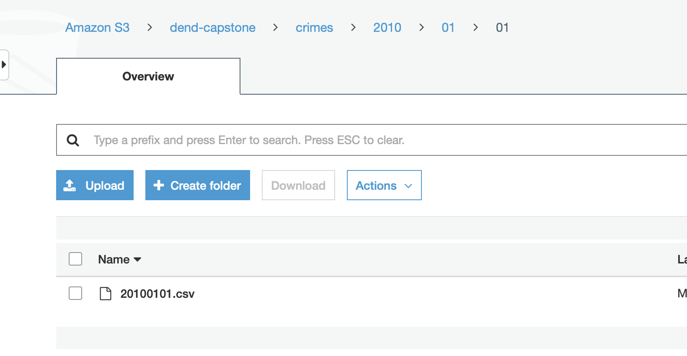

##Process
We will be using PySpark to analyse and store the data. We will be using Airflow to manage the orchestration.

Airflow Steps:
* Load Temperture and Crime Data
* Aggregate Temperature and Crime Data
* Check if Temperature and Crime Data are Valid
* Create a new dataframe and append it to the previous data using [Parquet](https://en.wikipedia.org/wiki/Apache_Parquet).

####Airflow Dag
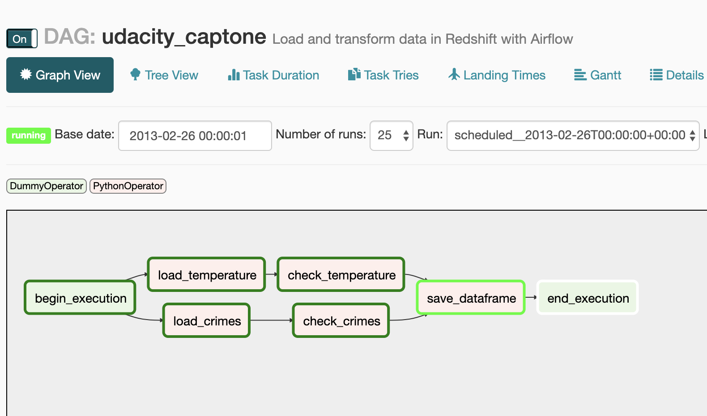

####Airflow Tree View
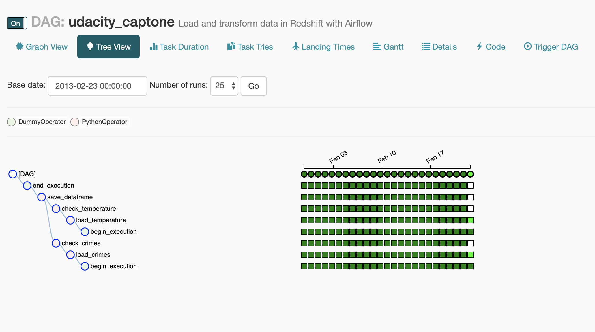

####Airflow Running Jobs
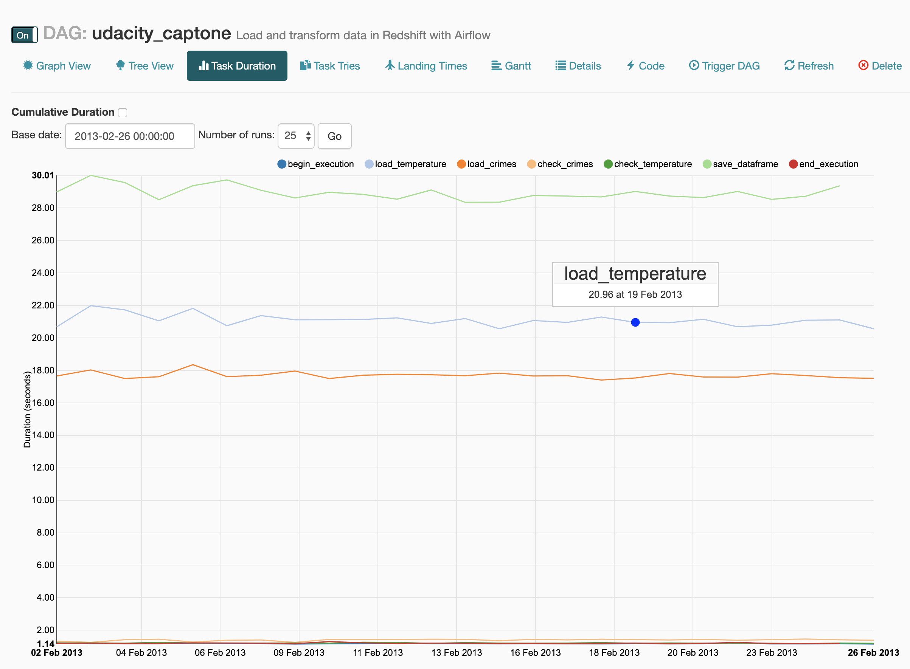

####Results on S3
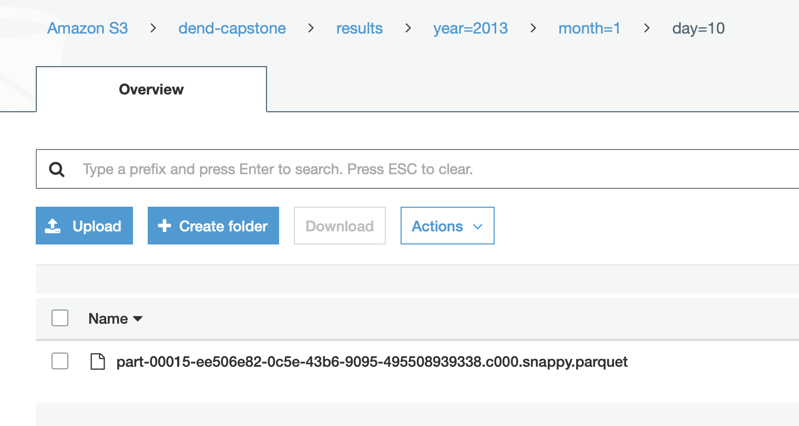

##Results
###Sample Results Dataframe
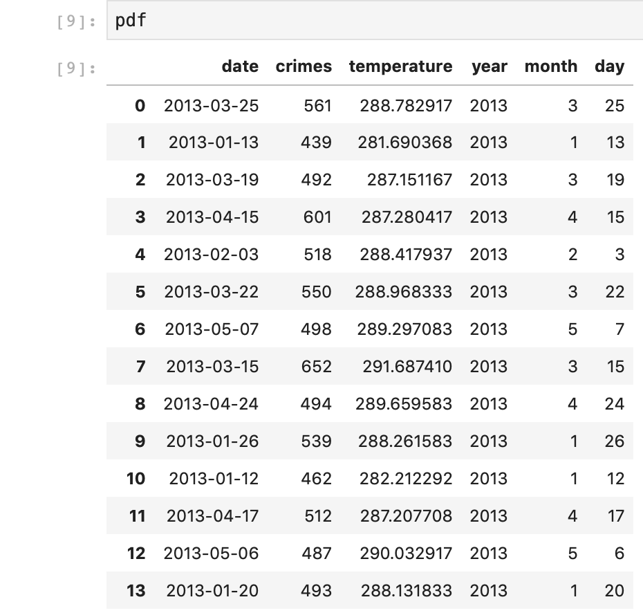

###Sample Graph
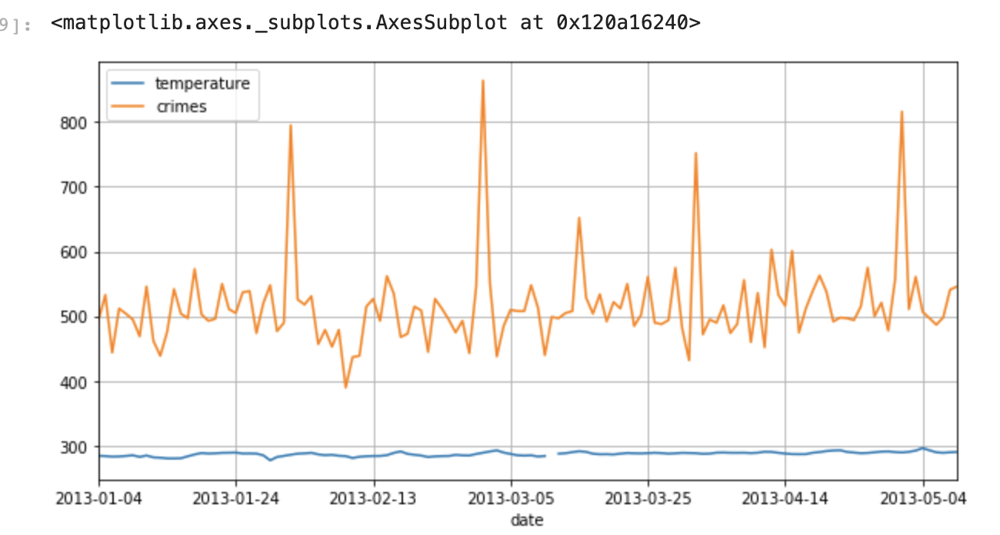
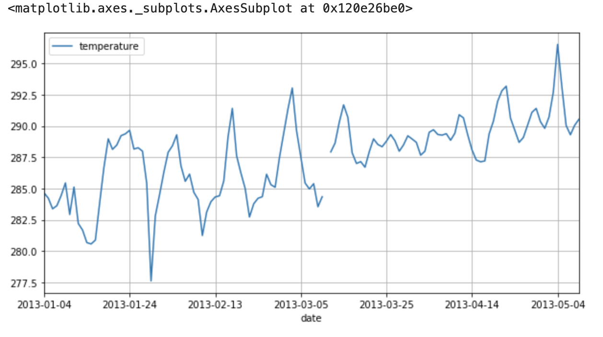
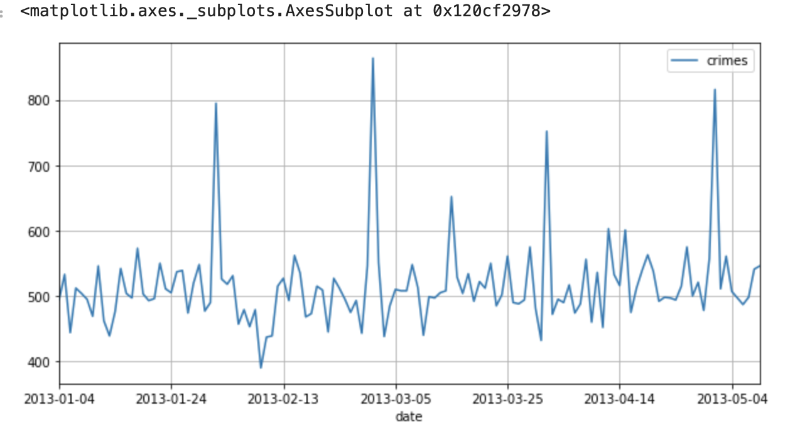

##Scaling
Since this system is build on Spark and Airflow it is very much horizontally scalable. Airflow can handle millions of records. 

[Benefits of Airflow](https://www.xenonstack.com/insights/what-is-apache-airflow/)

[What is Spark](https://databricks.com/spark/about)

##Conclusion
This is just a Toy Model to illustrate how you can use two open source technologies to create a massively parallel and scalable data processing system.

